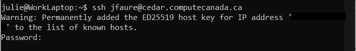

# Paraview Jour 2
## Retour sur les information de hier
Dans la session d'hier, nous avons explorés la connexion à un serveur distant pour utiliser Paraview en mode client-serveur. Nous avons utilisé JupyterHub pour faciliter les choses, mais nous aurions pu nous connecter directement à un serveur de Calcul Canada. Dans le cas où vous voudriez directement vous connecter sur un serveur, voici ce que vous devriez faire (prenez note que vous allez avoir besoin de deux fenêtres de terminal ou bien tmux https://github.com/tmux/tmux):

1. Ouvrez un terminal (ou MobaXterm)
2. Connectez vous par ssh en utilisant votre nom d'utilisateur à Calcul Canada sur Béluga, Graham, ou Cedar. Vous devrez taper votre mot de passe. Attention, vous ne verrez rien apparaître!




```python
ssh username@machine.calculcanada.ca
```

Nous vous demandons maintenant d'utiliser une clé SSH pour vous connecter. La marche à suivre est indiquée ici: https://docs.computecanada.ca/wiki/SSH_Keys/fr Voici le résultat lorsque vous utilisez une clé SSH.


Une fois connecté, vous pouvez démarrer une session interactive sous le compte de votre superviseur.


```python
salloc --time=3:00:0 --ntasks=16 --mem-per-cpu=4000 --account=def-votresuperviseur
```

et vous déplacer à l'emplacement de vos données.


```python
cd chemin/vers/vos/donnees
```

vous avez ensuite 2 options pour démarrer Paraview selon vos besoins:


```python
mpirun -np 16 pvserver # si vous avez besoin de mpi

# ou

srun pvserver
```

Après quelques temps, ce message devrait s'afficher:


```python
Waiting for client...
Connection URL: cs://machine1234.int.machine.computecanada.ca:11111 # machine = beluga, cedar ou graham
Accepting connection(s):
machine1234.int.machine.computecanada.ca:11111
```

Paraview vous indique qu'il est prêt à recevoir une connexion. Maintenant, dans un *deuxième* terminal, vous devez créer un tunnel SSH (c'est la première partie à copier dans l'interface JupyterHub):


```python
ssh username@machine.computecanada.ca -L 11111:machine1234:11111
```

Ensuite, sur votre ordinateur, vous procédez comme à l'habitude en ouvrant une connexion avec le port 1111. 


## Données d'aujourd'hui

Nous allons commencer sur notre ordinateur par un jeu de données médicales avec un scan de torse humain.


### Données médicales

Téléchargez et chargez le fichier CT-chest.nrrd

Dans les propriétés, il est idéal de définir le volume d'intérêt (VOI)
* x 0-511
* y 0-511
* z 0-138


Il peut s'agir d'un sous-échantillon si besoin. Dans notre cas, il aurait été possible de tout laisser à zéro. Dans ce cas, Paraview aurait chargé la totalité du volume.

Vous pouvez ensuite changer le rendu à volume, puis dans Coloring - edit - presets - yellow - blue - gray. 

Maintenant, ajoutez des points sur la droite d'opacité pour révéler seulement les éléments à plus haute densité (os et pacemaker).
Inversez la couleur.


Une telle visualisation peut être utile pour confirmer le succès d'une segmentation automatisée.

Par exemple, vous disposez également d'un fichier lungs_segments.stl, qui est une extraction des poumons faite à l'aide d'un algorithme de segmentation automatique.
Chargez lungs_segments.stl
Changez la couleur pour rose pâle.
Faites une rotation de la structure pour observer l'emplacement du coeur.
Vous devriez également identifier un problème avec le poumon gauche: de quoi s'agit-il?


### Données de Lac
Nous allons maintenant nous connecter sur l'environnement JupyterHub pour utiliser des données de Lac et de terrain.

#### Exercice

Connectez-vous à l'environnement comme nous l'avons fait hier.

Ensuite, nous allons charger les données du Lac:
1. Charger le fichier lac_full_volume.csv + Apply
2. Appliquer le filtre: table to points (set x = X_NAD83,y = Y_NAD83,z = elevation)
3. Fermer la table et ouvrir l'oeil de TableToPoints1

L'image apparaît en blanc puisque nous n'avons rien sélectioné.


Nous allons donc choisir une couleur pour la profondeur: 
4. Color: bathy
5. Dans Edit: presets- black, blue, white (ne JAMAIS prendre Rainbow)
6. Ajustez le gradient


Nous devons maintenant ajouter le terrain existant autour du lac. Le jeu de données provient de données Lidar traitées.

1. Charger le fichier Lac_terrain.csv + Apply
2. Appliquer le filtre: table to points (set x = x_coord,y = y_coord,z = hauteur)
3. Fermer la table et ouvrir l'oeil de TableToPoints1
4. Color: ombre
5. Edit: presets - linear green + invert color


Maintenant, vous constatez que l'eau est légèrement sous le niveau du sol, bien que le maximum de l'eau soit techiquement le même que le minimum du sol. C'est que le lac se trouve légèrement en altitude et cette information n'est pas incluse dans la mesure prise par le sonar. Il faut donc élever ou descendre l'un des jeux de données pour le faire coincider avec l'autre. Nous allons descendre le terrain:

1. Dans les propriétés: Advanced - transforming - translation (ou chercher Transforming)
2. Changer la valeur Z = -4


Pour faire un vidéo
1. Animation: orbit + "+"
2. Double-click camera + camera position
3. Ajuster les points dans l'image
4. Cliquer + pour ajouter des points si nécessaire
5. Mode: real time - duration: 20s

#### Exercice
Sauvegardez selon la méthode de votre choix et créez un vidéo avec l'animation


```python

```
